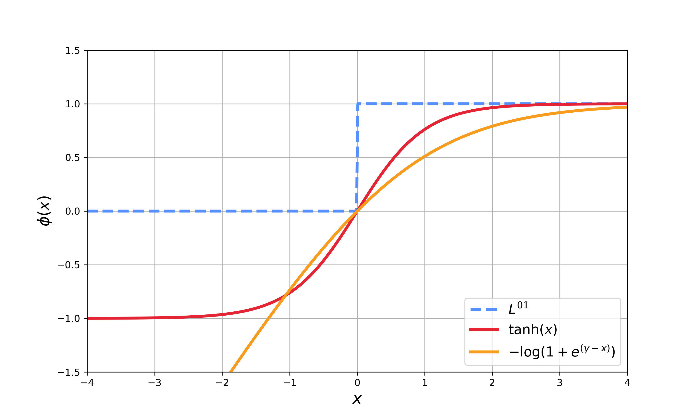

# Improving SAM Requires Rethinking its Optimization Formulation

This is official code for [Improving SAM Requires Rethinking its Optimization Formulation]() accepted at ICML 2024.

The lower-bound loss function for the maximizer defined in the paper is

$$  Q_{\phi, \mu}(w) = 
    \frac{1}{n} \sum_{i=1}^n \frac{1}{\mu} \log \left(\sum_{j=1}^K e^{\mu \phi({F_{w}(x_i,y_i)_j})} \right) 
$$

<!-- where $F_{w} (x_i, y_i)_j = f_{w} (x_i)_{j} - f_{w} (x_i) _{y_i}$. -->

<!-- where <p>$F_{w} (x_i, y_i)_j = f_{w} (x_i)_{j} - f_{w} (x_i)_{y_i}$</p> -->


Function $\phi(x)$ is the lower bound of 0-1 step function. We show 2 suggested lower bounds in the paper:
- For BiSAM (tanh), we set $\phi(x)=\tanh(\alpha x)$.
- For BiSAM (-log), we set $\phi(x) = -\log(1 + e^{(\gamma-x)}) + 1$ where $\gamma=\log(e-1)$.

The implementation of these 2 function can be found in `loss_fnc.py`

<!--  -->


## Setup

```
conda create -n bisam python=3.8
conda activate bisam

# On GPU
conda install pytorch torchvision torchaudio pytorch-cuda=12.1 -c pytorch -c nvidia

pip install -r requirements.txt
python train.py
```


## Usage

1. This code contains SAM, BiSAM (-log), BiSAM (tanh) on CIFAR-10/CIFAR-100 listed in Table 1&2 in the paper. Use `--opt bisam_log` to modify it.

    | --opt     | sam    | bisam_log     | bisam_tanh | 
    |-----------|--------|--------|--------|
    | optimizer | SAM    | BiSAM (-log)     | BiSAM (tanh)    | 
 

2. Example scripts:

    ```python
    python train.py --optim bisam_log --rho 0.05 --epochs 200 --learning_rate 0.1 --model resnet56 --dataset cifar10
    ```


<!-- ## Citation -->
<!-- ```
@inproceedings{pethick2023stable,
  title={Stable Nonconvex-Nonconcave Training via Linear Interpolation},
  author={Pethick, Thomas and Xie, Wanyun and Cevher, Volkan},
  booktitle={Advances in Neural Information Processing Systems (NeurIPS)},
  year={2023}
}
``` -->

## Reference Code
[1] [(Adaptive) SAM Optimizer](https://github.com/davda54/sam/tree/main)
